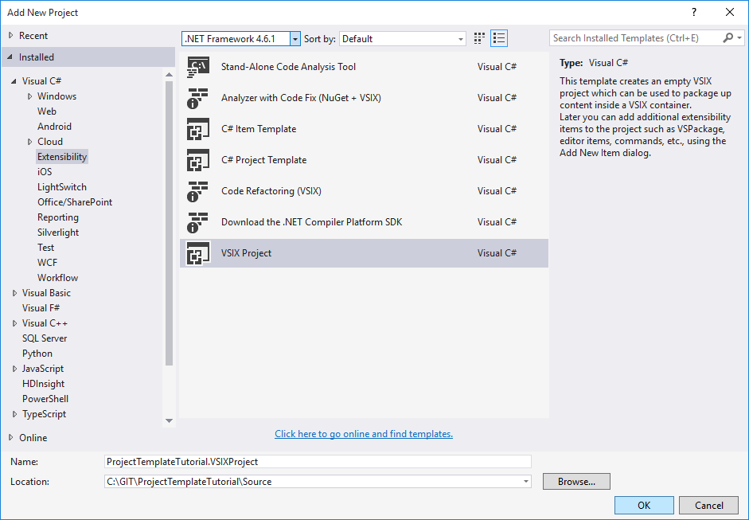
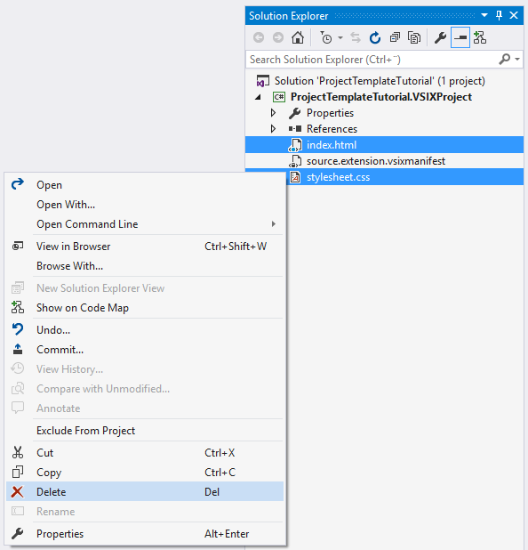

# ProjectTemplateTutorial
This is a tutorial on how to create a project template for Visual Studio with multiple projects, commands, dialogs and external tools.
The project template will have a mandatory and an optional project that you can choose from an dialog when the project is created.
There will also be an item template that uses Text Template Transformation Toolkit (T4) to generate code from an DSL.

## Prerequisites
I have the following softwares installed on my machine.

* Visual Studio 2015 Update 1
* Visual Studio SDK
* [Extensibility Tools for Visual Studio](https://github.com/madskristensen/ExtensibilityTools)

## Create a custom project template
This is a tutorial on how to create a project template with multiple projects, custom commands and dialogs. We will also add an external tool that generate code from a domain specific language.

### Solution
First we need a solution to add our project to. Open Visual Studio and follow the steps bellow.


*Choose the blank solution project template*

Now we have our solution that we can start adding project to.

### VSIX Project
The VSIX project where we will put all logic such as wizards, commands and dialogs. 



*Add a VSIX Project to the solution*



*Delete the unnecessary files*


*Add a folders for Wizards, Dialogs and Commands*

### Solution Project Template
This is an empty project template hows porpose is to trigger a wizard where we can add logic to add other project templates to our solution.

*Add the solution project template*

*Delete the unnecessary files*

*Add the solution wizard*

Now we need to add a wizard class where the logic for creating our project template.
 
```CSharp
// usings

namespace ProjectTemplateTutorial.VSIXProject.Wizards
{
    public class SolutionWizard : IWizard
    {
        // The rest of the code implementing the IWizard interface
                
        public void RunFinished()
        {
            int i = 0;
        }
    }
}
```
*The SolutionWizard class*

```xml
<WizardExtension>
  <Assembly>MultiProjectTemplateTutorial.Wizards, Version=1.0.0.0, Culture=neutral, PublicKeyToken=b490d4518b7bc751</Assembly>
  <FullClassName>MultiProjectTemplateTutorial.Wizards.SolutionWizard</FullClassName>
</WizardExtension>
```
*Add the WizardExtension element to the vstemplate file*

*Add a category for the project template in the new project dialog*

*Solution created*

### Mandatory project template
Let´s add the project template for the mandatory project in our project template.

*Add the mandatory project template*

*Code to add the mandatory project to the solution*

*Project created*

### Optional project template
Let´s add the project template for the optional project in our project template.

*Add the optional project template*

### Project creation dialog
We need a dialog to select the projects to be created.

*Add a CustomControl*

*Change the root element to Window*

*Change the base class in the code behind file to Window*

```xml
<Window>
</Window>
```
*The XAML for the solution dialog*

```CSharp
public void AddProject()
{
}
```
*Code to add the optional project to the solution*


*Project created*

## Add NuGet packages as part of the project creation process

### NuGet helper code

### Add NuGet packages

## Add a command

### VSPackage

### RelayCommand

### Implement some usefull feature with a dialog and NuGet packages

## Create a custom item template

### Item template

### T4 (Text Template Transformation Toolkit) Code Generation 
