# Project Template Tutorial
This is a tutorial on how to create a project template for Visual Studio with multiple projects, commands, dialogs and external tools.
The project template will have a mandatory and an optional project that you can choose from an dialog when the project is created.
There will also be an item template that uses Text Template Transformation Toolkit (T4) to generate code from an DSL.

## Step 0 : Prerequisites
I have the following softwares installed on my machine.

* Visual Studio 2015 Update 1
* Visual Studio SDK
* [Extensibility Tools for Visual Studio](https://github.com/madskristensen/ExtensibilityTools)
* [ILSyp](http://ilspy.net/)

When downloading the code from GitHub you have change the debug settings for the VSIXProject.
* Start Action : C:\Program Files (x86)\Microsoft Visual Studio 14.0\Common7\IDE\devenv.exe
* Command line arguments: /rootsuffix EXP


*Change the debug settings for the VSIXProject when downloading the code from GitHub*

If you want to skip some parts of the tutorial, you can download the code and start where you want.
* [Step 2 : Mandatory project template](https://github.com/dogtail9/ProjectTemplateTutorial#step-2--mandatory-project-template)
* [Step 3 : Optional project template](https://github.com/dogtail9/ProjectTemplateTutorial#step-3--optional-project-template)
* [Step 4 : NuGet packages](https://github.com/dogtail9/ProjectTemplateTutorial#step-4--nuget-packages)
* [Step 5 : Commands](https://github.com/dogtail9/ProjectTemplateTutorial#step-5--commands)
* [Step 6 : Create a custom item template](https://github.com/dogtail9/ProjectTemplateTutorial#step-6--create-a-custom-item-template)
* [Step 7 : Refactor some code to a reusable helper library](https://github.com/dogtail9/ProjectTemplateTutorial#step-7--refactor-some-code-to-a-reusable-helper-library)

## Step 1 : Create a custom project template
This is a tutorial on how to create a project template with multiple projects, custom commands and dialogs. We will also add an external tool that generate code from a domain specific language.

### Solution
First we need a solution to add our project to. Open Visual Studio and follow the steps bellow.


*Choose the blank solution project template*

Now we have our solution that we can start adding project to.

### VSIX Project
The VSIX project where we will put all logic such as wizards, commands and dialogs. 


*Add a VSIX Project to the solution*


*Delete the unnecessary files*


*Add folders for Commands, Dialogs and Wizards*

### Solution Project Template
Now we will add to a project template whose sole purpose is to run a wizard, where we can add the code to create our project.


*Add the solution project template*


*Delete the unnecessary files*

```xml
<Project File="ProjectTemplate.csproj" ReplaceParameters="true">
  <ProjectItem ReplaceParameters="true" TargetFileName="Properties\AssemblyInfo.cs">AssemblyInfo.cs</ProjectItem>
  <ProjectItem ReplaceParameters="true" OpenInEditor="true">Class1.cs</ProjectItem>
</Project>
```

*Delete the content of the TemplateContent element in the ProjectTemplateTutorial.Solution.vstemplate file*


*Change the type attribute of the VSTemplate element in the vstemplate file to ProjectGroup*

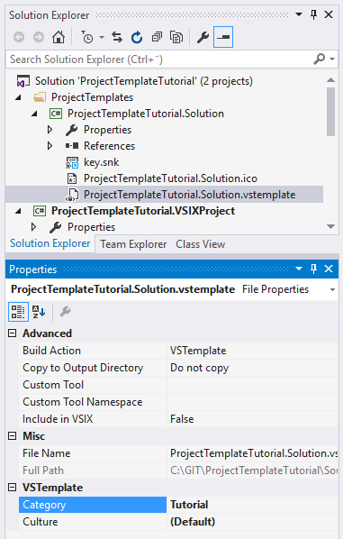

*Add a category for the project template in the new project dialog*


### Solution wizard
Now we need to add a wizard class where the logic for creating our project template.
Add a class to the Wizard folder in the VSIXProject, name it SolutionWizard. The SolutionWizard class should implement the IWizard interface.
Sign all projects in the solution.

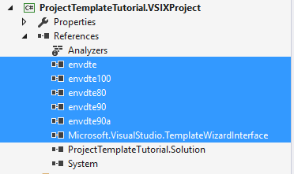

*Add the references to envdte and Microsoft.VisualStudio.TemplateWizardInterface in the VSIXProject*

```CSharp
using Microsoft.VisualStudio.TemplateWizard;
using System;
using System.Collections.Generic;
using System.Linq;
using System.Text;
using System.Threading.Tasks;
using EnvDTE;

namespace ProjectTemplateTutorial.VSIXProject.Wizards
{
    public class SolutionWizard : IWizard
    {
        public void BeforeOpeningFile(ProjectItem projectItem)
        {
        }

        public void ProjectFinishedGenerating(Project project)
        {
        }

        public void ProjectItemFinishedGenerating(ProjectItem projectItem)
        {
        }

        public void RunFinished()
        {
            int i = 0;
        }

        public void RunStarted(object automationObject, Dictionary<string, string> replacementsDictionary, WizardRunKind runKind, object[] customParams)
        {
        }

        public bool ShouldAddProjectItem(string filePath) => true;
    }
}
```

*The SolutionWizard class*

Set a breakpoint in the int i = 0; line in the RunFinished method.

### Assets
The only thing left to do is to add assets to the VSIXProject. Open the source.extension.vsixmanifest file in the VSIXProject. Add the assets below.


*Add assembly*


*Add project template*

### Add the wizard to the solution project template


*I use ILSpy to get the strongname of the ProjectTemplate.VSIXProject.dll*

```xml
<WizardExtension>
  <Assembly>ProjectTemplateTutorial.VSIXProject, Version=1.0.0.0, Culture=neutral, PublicKeyToken=b490d4518b7bc751</Assembly>
  <FullClassName> ProjectTemplateTutorial.VSIXProject.Wizards.SolutionWizard</FullClassName>
</WizardExtension>
```

*Add the WizardExtension element to VSTemplate element in the vstemplate file*

Let´s try to create a project with our project template.


*The project template is located in the tutorial category in the New Project dialog*


*The break point in the RunFinished method should be hit*


*The empty solution created is created*

We are done with the first step out of this tutorial.

## Step 2 : Mandatory project template
Let´s add the project template for the mandatory project in our project template.
If you skiped the first step in this tutorial you can download the code from the [Solution](https://github.com/dogtail9/ProjectTemplateTutorial/releases) release and start the tutorial here.  

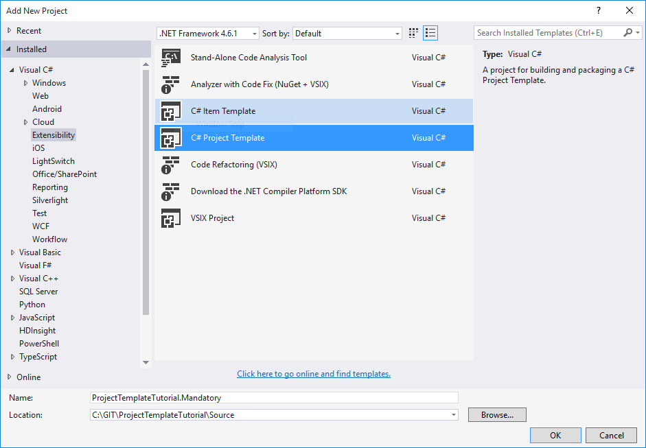

*Add the mandatory project template*

We want to hide this project template in the New Project dialog and add the project to the solution from the SolutionWizard class.

```xml
<Hidden>true</Hidden>
```

*Add the Hidden element to the TemplateData element in the ProjectTemplateTutorial.Mandatory.vstemplate file*


*Add the mandatory project template as an asset in the VSIXproject* 

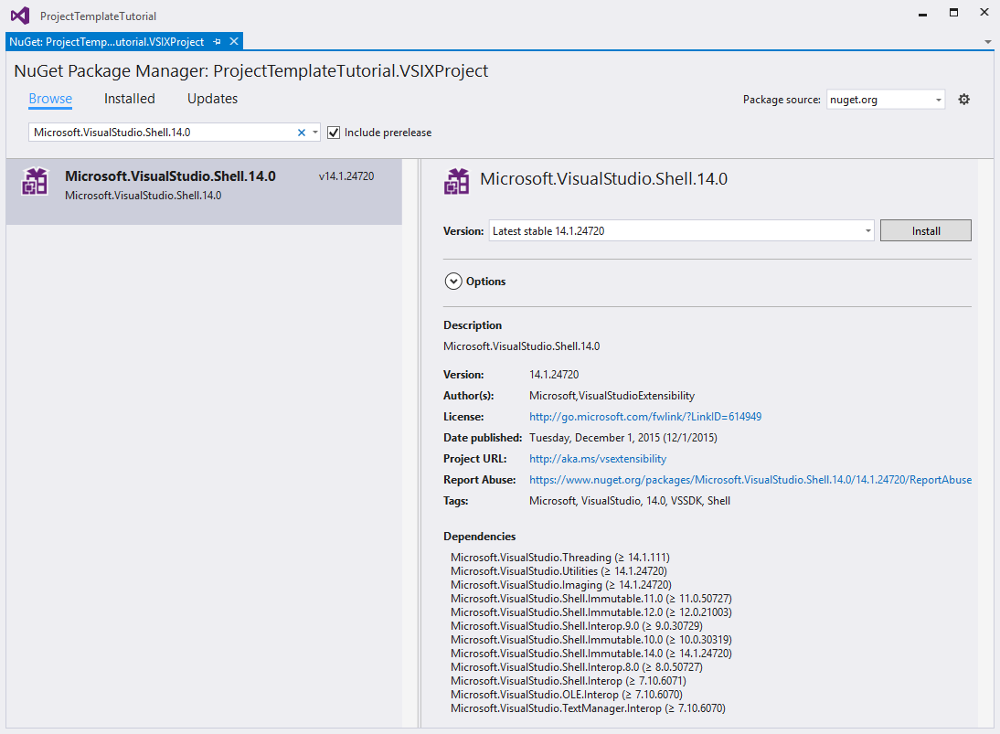

*Add the Microsoft.VisualStudio.Shell.14.0 NuGet package to the VSIXProject*

Let's write the code to add the mandatory project to the solution. Visual Studio passes a dictionary with data from the New Project dialog to the wizard. We need to save this data and use it to create the mandatory project from our mandatory project template. 

```CSharp
private Dictionary<string, string> _replacementsDictionary = new Dictionary<string, string>();
DTE _dte;

public SolutionWizard()
{
    _dte = ServiceProvider.GlobalProvider.GetService(typeof(DTE)) as DTE;
}
```

*Add constructor and fields to the SolutionWizard class*

```CSharp
public void RunStarted(object automationObject, Dictionary<string, string> replacementsDictionary, WizardRunKind runKind, object[] customParams)
{
    _replacementsDictionary = replacementsDictionary;
}
```

*Store the replacementsDictionary in the field in the RunStarted method*

```CSharp
public void RunFinished()
{
    string destination = _replacementsDictionary["$destinationdirectory$"];
    string fileName = _replacementsDictionary["$safeprojectname$"] + ".sln";
    _dte.Solution.SaveAs(Path.Combine(destination, fileName));
    
    var projectName = $"{_replacementsDictionary["$safeprojectname$"]}.Mandatory";
    var templateName = "ProjectTemplateTutorial.Mandatory";

    AddProject(destination, projectName, templateName);
}
```

*Get the data for our project from the replacementsDictionary and pass it to the AddProject method*

We will use the DTE object to add the project to our solution. Later we will refactor this method to a helper library so we can reuse it in other project templates but for now just put the AddProject method in the SolusionWizard class. 

```CSharp
private void AddProject(string destination, string projectName, string templateName)
{
    string projectPath = Path.Combine(destination, projectName);
    string templatePath = ((Solution4)_dte.Solution).GetProjectTemplate(templateName, "CSharp");

    _dte.Solution.AddFromTemplate(templatePath, projectPath, projectName, false);
}
```

*Code to add the a project to the solution*

Let's try the project template to se that the mandatory project is created.


*The mandatory project is created*

You can also add projects and use the build in project template if you like. You find the build in project templates in the *C:\Program Files (x86)\Microsoft Visual Studio 14.0\Common7\IDE\ProjectTemplate*s folder.

```CSharp
projectName = $"{_replacementsDictionary["$safeprojectname$"]}.WCFServiceLibrary";
AddProject(destination, projectName, "WcfServiceLibrary");
```

*Add a WCFServiceLibrary to the solution*


*The built-in WCFServiceLibrary template is now added to the solution*

We are done with step two of this tutorial. 

## Step 3 : Optional project template
Let´s add the project template and a dialog for the optional project in our project template.
If you skiped the second step in this tutorial you can download the code from the [Mandatory](https://github.com/dogtail9/ProjectTemplateTutorial/releases) release and start the tutorial here.  


*Add the optional project template*

```xml
<Hidden>true</Hidden>
```

*Add the Hidden element to the TemplateData element in the ProjectTemplateTutorial.Mandatory.vstemplate file*


*Add the mandatory project template as an asset in the VSIXproject*

### Project creation dialog
We need a dialog to select the projects to be created.


*Add a User Control (there is no window item temptale but we will fix this)*

We need to change the class from UserControl to a Window class. Visual Studio has a class called DialogWindow in the Microsoft.VisualStudio.PlatformUI namespace that we will use.

```xml
 xmlns:platformUI="clr-namespace:Microsoft.VisualStudio.PlatformUI;assembly=Microsoft.VisualStudio.Shell.14.0"
```

*Add the Microsoft.VisualStudio.PlatformUI namespace to the XAML file*

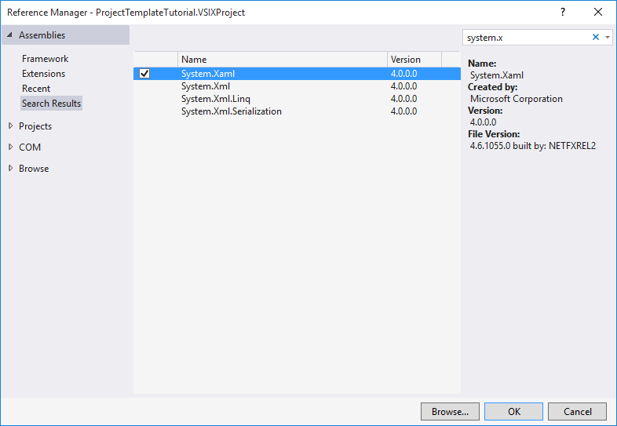
*Add a reference to System.Xaml in the VSIXProject*

In the XAML file change the root element from UserControl to platformUI:DialogWindow. In the code behind file change the base class from UserControl to DialogWindow.

We need some images to for our SolutionWizardDialog. Use the Image Export Moniker dialog from the extensibility tools to export images for Solution and CSProjectNode.


*Create a new folder names Resources in the VSIXProject an add the files to that folder*
 
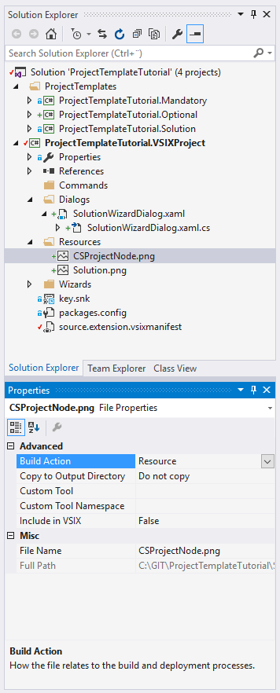
 
*Change the Build Action for the image files to Resource*

```xml
<platformUI:DialogWindow x:Class="ProjectTemplateTutorial.VSIXProject.Dialogs.SolutionWizardDialog"
             xmlns="http://schemas.microsoft.com/winfx/2006/xaml/presentation"
             xmlns:x="http://schemas.microsoft.com/winfx/2006/xaml"
             xmlns:mc="http://schemas.openxmlformats.org/markup-compatibility/2006" 
             xmlns:local="clr-namespace:ProjectTemplateTutorial.VSIXProject.Dialogs"
             xmlns:platformUI="clr-namespace:Microsoft.VisualStudio.PlatformUI;assembly=Microsoft.VisualStudio.Shell.14.0"
             Width="370" 
             Height="210"
             Title="Create Solution"
             WindowStartupLocation="CenterScreen" 
             ResizeMode="NoResize" 
             ShowInTaskbar="False">
    <Grid>
        <Image Source="pack://application:,,,/ProjectTemplateTutorial.VSIXProject;component/Resources/Solution.png" 
               Width="15" 
               Height="15" 
               VerticalAlignment="Top" 
               HorizontalAlignment="Left"
               Margin="10,10,0,0"/>

        <Image Source="pack://application:,,,/ProjectTemplateTutorial.VSIXProject;component/Resources/CSProjectNode.png" 
               Width="15" 
               Height="15"
               VerticalAlignment="Top"
               HorizontalAlignment="Left"
               Margin="33,31,0,0"/>

        <Image Source="pack://application:,,,/ProjectTemplateTutorial.VSIXProject;component/Resources/CSProjectNode.png" 
               Width="15"
               Height="15"
               VerticalAlignment="Top"
               HorizontalAlignment="Left"
               Margin="33,51,0,0"/>

        <TextBlock x:Name="SolutionNameTbx" 
                   HorizontalAlignment="Stretch" 
                   VerticalAlignment="Top"
                   Margin="30,10,10,0" 
                   Text="SolutionName"/>

        <TextBlock x:Name="MandatoryProjectNameTbx" 
                   HorizontalAlignment="Stretch" 
                   VerticalAlignment="Top" 
                   Margin="53,31,17,0" 
                   Text="MandatoryProjectName"/>

        <CheckBox x:Name="OptionalProjectNameCbx" 
                  HorizontalAlignment="Stretch" 
                  VerticalAlignment="Top" 
                  Margin="53,51,17,0" 
                  IsChecked="True"
                  Content="OptionalProjectName" />

        <Button x:Name="CancelBtn" 
                HorizontalAlignment="Right" 
                VerticalAlignment="Bottom" 
                Width="75" 
                Content="Cancel" 
                Margin="0,0,10,10" 
                Click="CancelBtn_Click"/>

        <Button x:Name="OKBtn" 
                HorizontalAlignment="Right" 
                VerticalAlignment="Bottom" 
                Width="75" 
                Content="OK" 
                Margin="0,0,90,10" 
                Click="OKBtn_Click"/>
    </Grid>
</platformUI:DialogWindow>
```

*The XAML in the SolutionWizardDialog.xaml file*

```CSharp
public partial class SolutionWizardDialog : DialogWindow
{
    public SolutionWizardDialog(string safeProjectName)
    {
        InitializeComponent();

        SolutionNameTbx.Text = $"{safeProjectName}";
        MandatoryProjectNameTbx.Text = $"{safeProjectName}.Mandatory";
        OptionalProjectNameCbx.Content = $"{safeProjectName}.Optional";
    }

    private void OKBtn_Click(object sender, RoutedEventArgs e)
    {
        DialogResult = true;
        Close();
    }

    private void CancelBtn_Click(object sender, RoutedEventArgs e)
    {
        DialogResult = false;
        Close();
    }
}
```

*The code in the code behing file*

Let's open the dialog window when we create our project.

```CSharp
SolutionWizardDialog dialog = new SolutionWizardDialog(_replacementsDictionary["$safeprojectname$"]);
var result = dialog.ShowModal();

if (result == null || !result.Value)
{
    throw new WizardCancelledException();
}
else
{
    _addOptionalProject = (bool)dialog.OptionalProjectNameCbx.IsChecked;
}
```

*Open the dialog in the RunStarted method of the SolutionWizard class and save the value of the checkbox in the _addOptionalProject field*

```CSharp
if (_addOptionalProject)
{
    projectName = $"{_replacementsDictionary["$safeprojectname$"]}.Optional";
    templateName = "ProjectTemplateTutorial.Optional";

    AddProject(destination, projectName, templateName);
}
```
*Add code to the RunFinished method to add the optional project if the checkbox is checked*

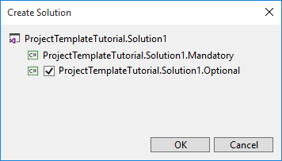

*The SolutionWizardDialog pops up when you create a new project with the project template*

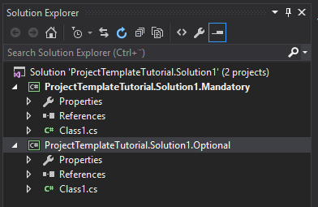

*If the checkbox for the optional project is checked the optional project will be created*

We are done with step three of this tutorial. 

## Step 4 : NuGet packages
If we want to add NuGet packages to one or more of our projects we can do that by using the IVsPackageInstallerServices i Visual Studio.
If you skiped the third step in this tutorial you can download the code from the [Optional](https://github.com/dogtail9/ProjectTemplateTutorial/releases) release and start the tutorial here.  

### Add NuGet packages
Add the InstallNuGetPackage method to the SolutionWizard class. 
In the next step of this tutorial we will refactor this method and the AppProject method to a helper library so we can reuse it in other project templates but for now just put it in the SolusionWizard class.


*Add a reference to Microsoft.VisualStudio.ComponentModelHost in the VSIXProject*

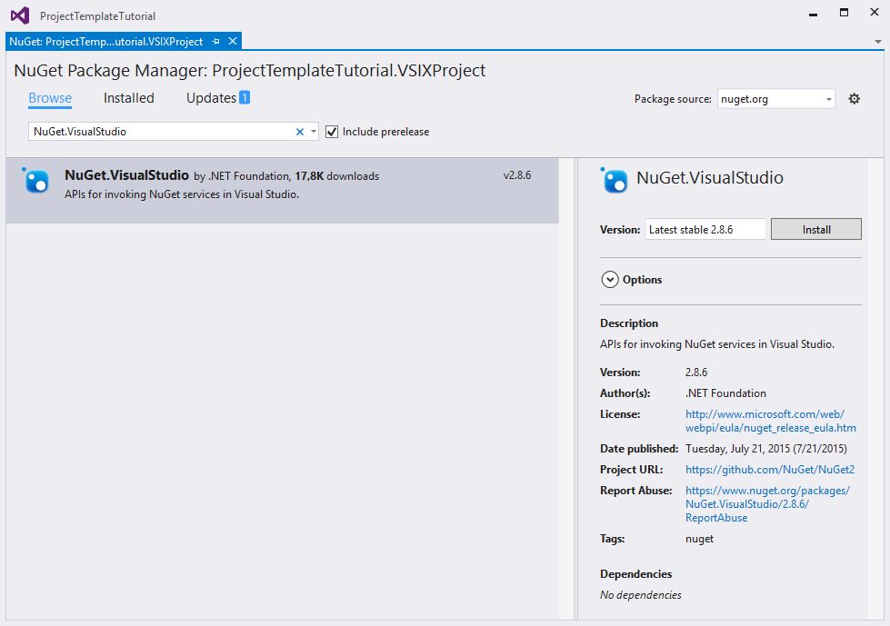

*Add the NuGet.VisualStudio NuGet package to the VSIXProject*

### Install NuGet packages

```CSharp
private bool InstallNuGetPackage(string projectName, string package)
{
    bool installedPkg = true;

    Project project = (from Project p in (Array)_dte.ActiveSolutionProjects
                       where p.Name.Equals(projectName)
                       select p).First();
    try
    {
        var componentModel = (IComponentModel)Package.GetGlobalService(typeof(SComponentModel));
        IVsPackageInstallerServices installerServices = componentModel.GetService<IVsPackageInstallerServices>();
        if (!installerServices.IsPackageInstalled(project, package))
        {
            _dte.StatusBar.Text = @"Installing " + package + " NuGet package, this may take a minute...";
            IVsPackageInstaller installer = componentModel.GetService<IVsPackageInstaller>();
            installer.InstallPackage(null, project, package, (System.Version)null, false);
            _dte.StatusBar.Text = @"Finished installing the " + package + " NuGet package";
        }
    }
    catch (Exception ex)
    {
        string t = ex.Message;
        installedPkg = false;
        _dte.StatusBar.Text = @"Unable to install the  " + package + " NuGet package";
    }

    return installedPkg;
}
```

*Code that adds a NuGet package to a project*

```CSharp
 InstallNuGetPackage(projectName, "Newtonsoft.Json");
```

*Install the Newtonsoft.Json NuGet package*


*Newtonsoft.Json is added to the optional project*

We are done with step four of this tutorial.

## Step 5 : Commands
Commands are way to implement tools for a particular task in your project template. For example, the developer should be able to create a copyright note in every source code file in a project.
If you skiped the fourth step in this tutorial you can download the code from the [NuGet](https://github.com/dogtail9/ProjectTemplateTutorial/releases) release and start the tutorial here.

### RelayCommand
We will create the reusable command class RelayCommand that takes a delegate as a parameter for eventhandlern.


*Add the RelayCommand to the Commands folder in the VSIXProject*


*Use the Auto-sync VSCT commands feature from the extensibility tools on the vsct file*

```xml
<?xml version="1.0" encoding="utf-8"?>
<CommandTable xmlns="http://schemas.microsoft.com/VisualStudio/2005-10-18/CommandTable" 
              xmlns:xs="http://www.w3.org/2001/XMLSchema">
  <Extern href="stdidcmd.h"/>
  <Extern href="vsshlids.h"/>

  <Commands package="guidRelayCommandPackage">
    <Groups>
    </Groups>

    <Menus>
    </Menus>

    <Buttons>
    </Buttons>

    <Bitmaps>
      <Bitmap guid="guidImages" 
              href="Resources\RelayCommand.png" 
              usedList="bmpPic1, bmpPic2, bmpPicSearch, bmpPicX, bmpPicArrows, bmpPicStrikethrough"/>
    </Bitmaps>
  </Commands>
  
  <CommandPlacements>
  </CommandPlacements>
  
  <Symbols>
    <GuidSymbol name="guidRelayCommandPackage" value="{edc30286-8947-4257-9355-8d5d25829c5d}" />

    <GuidSymbol name="guidRelayCommandPackageCmdSet" value="{977a44b1-3da7-4b57-9e13-253a15116874}">
      
    </GuidSymbol>

    <GuidSymbol name="guidImages" value="{9a4ae56f-11f2-443e-8533-e1c6a67b471d}" >
      <IDSymbol name="bmpPic1" value="1" />
      <IDSymbol name="bmpPic2" value="2" />
      <IDSymbol name="bmpPicSearch" value="3" />
      <IDSymbol name="bmpPicX" value="4" />
      <IDSymbol name="bmpPicArrows" value="5" />
      <IDSymbol name="bmpPicStrikethrough" value="6" />
    </GuidSymbol>
  </Symbols>
</CommandTable>
```

*Clean up the vsct file and add the Menus and CommandPlacements elements*

```xml
<GuidSymbol name="guidRelayCommandPackageCmdSet" value="{977a44b1-3da7-4b57-9e13-253a15116874}">
  <IDSymbol name="ProjectContextGroup" value="0x0100" />
  <IDSymbol name="ProjectContextMenu" value="0x0200" />
  <IDSymbol name="ProjectContextMenuGroup" value="0x0300" />
  <IDSymbol name="AddCopyrightCommand" value="0x0400"/>
</GuidSymbol>
```

*Add the IDSymbols for the context menu and button*

```xml
<Groups>
  <Group guid="guidRelayCommandPackageCmdSet" id="ProjectContextGroup" priority="0x0000"/>
  <Group guid="guidRelayCommandPackageCmdSet" id="ProjectContextMenuGroup" priority="0x0000"/>
</Groups>
```

*Add the groups*

```xml
<Menus>
  <Menu guid="guidRelayCommandPackageCmdSet" id="ProjectContextMenu" type="Context" priority="0x0100">
    <Strings>
      <CommandName>Project Template Tutorial</CommandName>
      <ButtonText>Project Template Tutorial</ButtonText>
      <MenuText>Project Template Tutorial</MenuText>
      <ToolTipText>Project Template Tutorial</ToolTipText>
    </Strings>
  </Menu>
</Menus>
```

*Add the contextmenu*

```xml
<Buttons>
  <Button guid="guidRelayCommandPackageCmdSet" id="AddCopyrightCommand" priority="0x0100" type="Button">
    <Icon guid="guidImages" id="bmpPic1" />
    <Strings>
      <ButtonText>Add Copyright Comment</ButtonText>
    </Strings>
  </Button>
</Buttons>
```

*Add the button*

```xml
<CommandPlacements>
  <CommandPlacement guid="guidRelayCommandPackageCmdSet" id="ProjectContextGroup" priority="0x0000">
    <Parent guid="guidSHLMainMenu" id="IDM_VS_CTXT_PROJNODE" />
  </CommandPlacement>

  <CommandPlacement guid="guidRelayCommandPackageCmdSet" id="ProjectContextMenu" priority="0x0100">
    <Parent guid="guidRelayCommandPackageCmdSet" id="ProjectContextGroup" />
  </CommandPlacement>

  <CommandPlacement guid="guidRelayCommandPackageCmdSet" id="ProjectContextMenuGroup" priority="0x0100">
    <Parent guid="guidRelayCommandPackageCmdSet" id="ProjectContextMenu" />
  </CommandPlacement>

  <CommandPlacement guid="guidRelayCommandPackageCmdSet" id="AddCopyrightCommand" priority="0x0100">
    <Parent guid="guidRelayCommandPackageCmdSet" id="ProjectContextMenuGroup" />
  </CommandPlacement>
</CommandPlacements>
```

*Add the hirarcy of all symbols to place the button in the context menu and the context menu in the contextmenu of the project*

```CSharp
internal sealed class RelayCommand
{
    private readonly Package package;

    public RelayCommand(Package package, int commandId, Guid commandSet, Action<object, EventArgs> menuCallback, Action<object, EventArgs> beforeQueryStatus = null)
    {
        this.package = package;

        OleMenuCommandService commandService = ServiceProvider.GetService(typeof(IMenuCommandService)) as OleMenuCommandService;
        if (commandService != null)
        {
            var MenuCommandID = new CommandID(commandSet, commandId);
            var MenuItem = new OleMenuCommand(menuCallback.Invoke, MenuCommandID);
            if (beforeQueryStatus != null)
            {
                MenuItem.BeforeQueryStatus += beforeQueryStatus.Invoke;
            }
            commandService.AddCommand(MenuItem);
        }
    }

    private IServiceProvider ServiceProvider => this.package;
}
```

```CSharp
[ProvideAutoLoad("{f1536ef8-92ec-443c-9ed7-fdadf150da82}")]
[PackageRegistration(UseManagedResourcesOnly = true)]
[InstalledProductRegistration("#110", "#112", "1.0", IconResourceID = 400)] // Info on this package for Help/About
[ProvideMenuResource("Menus.ctmenu", 1)]
[Guid(PackageGuids.guidRelayCommandPackageString)]
[SuppressMessage("StyleCop.CSharp.DocumentationRules", "SA1650:ElementDocumentationMustBeSpelledCorrectly", Justification = "pkgdef, VS and vsixmanifest are valid VS terms")]
public sealed class RelayCommandPackage : Package
{
    private RelayCommand addCopyrightCommand;

    public RelayCommandPackage()
    {
   
    }
   
    protected override void Initialize()
    {
        addCopyrightCommand = new RelayCommand(this, PackageIds.AddCopyrightCommand, PackageGuids.guidRelayCommandPackageCmdSet,
            (sender, e) =>
            {
                string message = string.Format(CultureInfo.CurrentCulture, "Inside {0}.MenuItemCallback()", this.GetType().FullName);
                string title = "RelayMenuCommandCallback";

                // Show a message box to prove we were here
                VsShellUtilities.ShowMessageBox(
                    ServiceProvider.GlobalProvider,
                    message,
                    title,
                    OLEMSGICON.OLEMSGICON_INFO,
                    OLEMSGBUTTON.OLEMSGBUTTON_OK,
                    OLEMSGDEFBUTTON.OLEMSGDEFBUTTON_FIRST);
            },
            (sender, e) =>
            {
                var cmd = (OleMenuCommand)sender;
                cmd.Visible = true;
            });

        base.Initialize();
    }
}
```

*Initialize the command in the package class. For now the command only shows a message box.*


*The command is located in the context menu of the project*

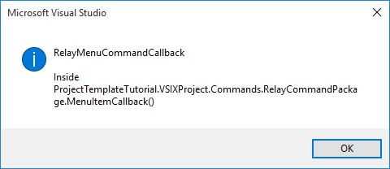

*MessageBox shown when the command is tiggered*

### Implement the Add Copyright Comment command

```Csharp
protected override void Initialize()
{
    addCopyrightCommand = new RelayCommand(
        this, 
        PackageIds.AddCopyrightCommand, 
        PackageGuids.guidRelayCommandPackageCmdSet,
        AddCopyrightComment
        ,
        (sender, e) =>
        {
            var cmd = (OleMenuCommand)sender;
            cmd.Visible = true;
        });

    base.Initialize();
}
```

*Change the addCopyrightCommand object initialization*

```CSharp
private void AddCopyrightComment(object sender, EventArgs e)
{
    DTE dte = GetService(typeof(DTE)) as DTE;

    Array projects = (Array)dte.ActiveSolutionProjects;
    
    foreach (Project project in projects)
    {
        foreach (ProjectItem projectItem in project.ProjectItems)
        {
            Document document;
            try
            {
                projectItem.Open();
                document = projectItem.Document;
            }
            catch (Exception)
            {
                Console.WriteLine("failed to load document");
                continue;
            }
            if (document == null)
            {
                continue;
            }

            TextDocument editDoc = (TextDocument)document.Object("TextDocument");
            
            if (document.Name.EndsWith(".cs"))
            {
                EditPoint objEditPt = editDoc.CreateEditPoint();
                objEditPt.StartOfDocument();
                document.ReadOnly = false;

                objEditPt.Insert("//-----------------------------------------------------------------------------");
                objEditPt.Insert(Environment.NewLine);
                objEditPt.Insert("// Copyright (c) The Corporation.  All rights reserved.");
                objEditPt.Insert(Environment.NewLine);
                objEditPt.Insert("//-----------------------------------------------------------------------------");
                objEditPt.Insert(Environment.NewLine);

                document.Save(document.FullName);
            }
        }
    }
}
```

*Code to add the copyright text to every C# file in a project*

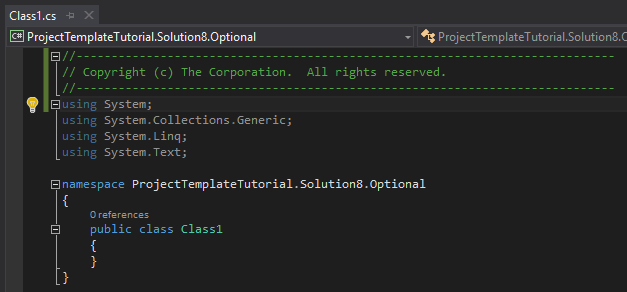

*Copyright comment added to code file*

### Manage the visibility of the command with metadata in the project file
The Add Copyright Comment command is visible in all types of projects in Visual Studio. If the command is of a general nature, it is a desired behavior, but if the command is specific to this particular project template we want to hide the command if the project are not created with our project template.


*The command is visible on all project types*

Let's add some metadata to the project file for bot of our projects and only show our command if the user right clicks on the Mandatory project.
We need two methods, one that sets the metadata on the project and one that checks if the project contains a specific value in the metadata.

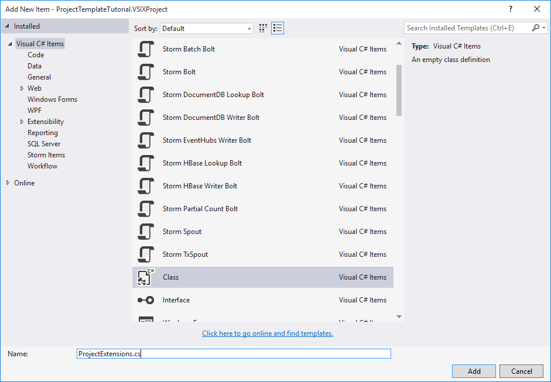

*Add a class named ProjectExtensions to the Commands folder in the VSIXProject, this class will also be moved to the helper library in the next step.*

```CSharp
public static class ProjectExtensions
{
    public static void SetResponsibility(this Project project, params ProjectResponsibilities[] responsibilities)
    {
        foreach (var res in Enum.GetValues(typeof(ProjectResponsibilities)))
        {
            string name = res.ToString();
            project.Globals[name] = Boolean.FalseString;
            project.Globals.set_VariablePersists(name, true);
        }

        foreach (var res in responsibilities)
        {
            string name = res.ToString();
            project.Globals[name] = Boolean.TrueString;
            project.Globals.set_VariablePersists(name, true);
        }
    }

    public static bool IsProjectResponsible(this Project project, Enum responsibility)
    {
        if (project == null)
            throw new ArgumentNullException(nameof(project));

        if (project.Globals.get_VariableExists(responsibility.ToString()))
        {
            string propertyValue = (string)project.Globals[responsibility.ToString()];
            bool propertyValueBoolean;

            if (Boolean.TryParse(propertyValue, out propertyValueBoolean))
            {
                if (propertyValueBoolean)
                {
                    return true;
                }
            }
        }

        return false;
    }
}
```

*Code to add and check for metadata in a project*

```Charp
public enum ProjectResponsibilities
{
    Mandatory,
    Optional
}
```

*We use an enum for the diferet values of the project metadata*

```CSharp
private Project AddProject(string destination, string projectName, string templateName)
{
    string projectPath = Path.Combine(destination, projectName);
    string templatePath = ((Solution4)_dte.Solution).GetProjectTemplate(templateName, "CSharp");

    _dte.Solution.AddFromTemplate(templatePath, projectPath, projectName, false);

    Project project = (from Project p in _dte.Solution.Projects
                       where p.Name.Equals(projectName)
                       select p).FirstOrDefault();

    return project;
}
```

*Modify the AddProject method in the SolutionWizard class. The AddFromTemplate always returns null thats why we need to interate through the project to find the newly created project and return it.* 

```CSharp
Project mandatoryPproject = AddProject(destination, projectName, templateName);
mandatoryPproject.SetResponsibility(ProjectResponsibilities.Mandatory);

Project optionalProject = AddProject(destination, projectName, templateName);
optionalProject.SetResponsibility(ProjectResponsibilities.Optional);
```

*Set the responsibilities for the projects in the SolutionWizard class*

```xml
<ProjectExtensions>
  <VisualStudio>
    <UserProperties Optional="False" Mandatory="True" />
  </VisualStudio>
</ProjectExtensions>
```

*Metadata in the csproj file for the mandatory project*

```xml
<Buttons>
  <Button guid="guidRelayCommandPackageCmdSet" id="AddCopyrightCommand" priority="0x0100" type="Button">
    <Icon guid="guidImages" id="bmpPic1" />
    <CommandFlag>DynamicVisibility</CommandFlag>
    <CommandFlag>TextChanges</CommandFlag>
    <CommandFlag>DontCache</CommandFlag>
    <CommandFlag>DefaultInvisible</CommandFlag>
    <Strings>
      <ButtonText>Add Copyright Comment</ButtonText>
    </Strings>
  </Button>
</Buttons>
```

*Add the CommandFlags elements to the Button element in the vsct file in the VSIXProject*

```CSharp
addCopyrightCommand = new RelayCommand(
    this,
    PackageIds.AddCopyrightCommand,
    PackageGuids.guidRelayCommandPackageCmdSet,
    AddCopyrightComment,
    (sender, e) =>
    {
        DTE dte = GetService(typeof(DTE)) as DTE;

        Array projects = (Array)dte.ActiveSolutionProjects;
        Project current = (Project)projects.GetValue(0);

        var cmd = (OleMenuCommand)sender;
        cmd.Visible = current.IsProjectResponsible(ProjectResponsibilities.Mandatory);
    });
```

*Change the command so that it only appears if the project has the Mandatory responsibility*


*The Add Copyright Command shows up if you right click the mandatory project*


*The Add Copyright Command is hidden if you right click the optional project*


*The Add Copyright Command no longer shows up in other project templates*

We are done with the command step of this tutorial.

## Step 6 : Create a custom item template
Let's create an item template with a custom tool to generate C # code from Json data. 
If you skiped the fifth step in this tutorial you can download the code from the [Commands](https://github.com/dogtail9/ProjectTemplateTutorial/releases) release and start the tutorial here.

### Item template
First we need the item template project.

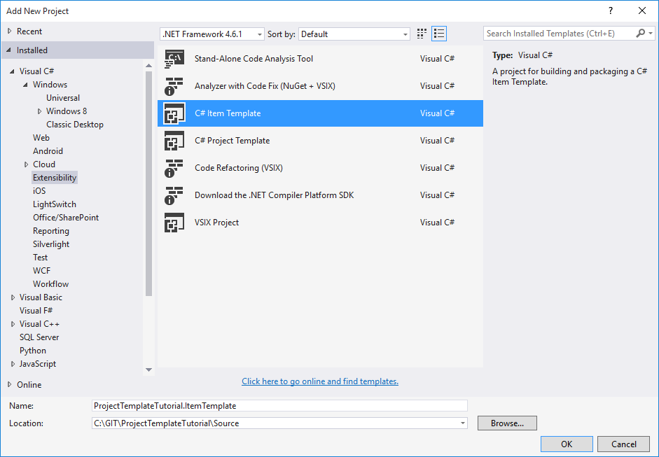

*Add an item template project to the ProjectTemplates folder*

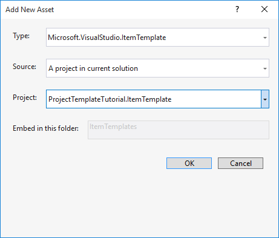

*Add the item tempalte project to the assets in the VSIXProject*

```json
{
  'Email': 'example@example.com',
  'Active': true,
  'CreatedDate': '2015-01-15T00:00:00Z'
}
```

*Delete the Class.cs file in the item template project and a text file names Json.jc with the content above*

```xml
<WizardExtension>
  <Assembly>Microsoft.VSDesigner, Version=10.0.0.0, Culture=Neutral, PublicKeyToken=b03f5f7f11d50a3a</Assembly>
  <FullClassName>Microsoft.VSDesigner.ProjectWizard.ItemPropertyWizard</FullClassName>
</WizardExtension>
```

*Add the WizardExtension element to the vstemplate file int the item template project*

```xml
<DefaultName>Json.jc</DefaultName>
```

*Change the default name to Json.jc*

```xml
<TemplateContent>
  <ProjectItem ReplaceParameters="true" TargetFileName="$safeitemname$.jc">Json.jc</ProjectItem>
</TemplateContent>
```

*Change the TemplateContent element*


*Set the catergory property of the vstemplate file in the item tempalte project*

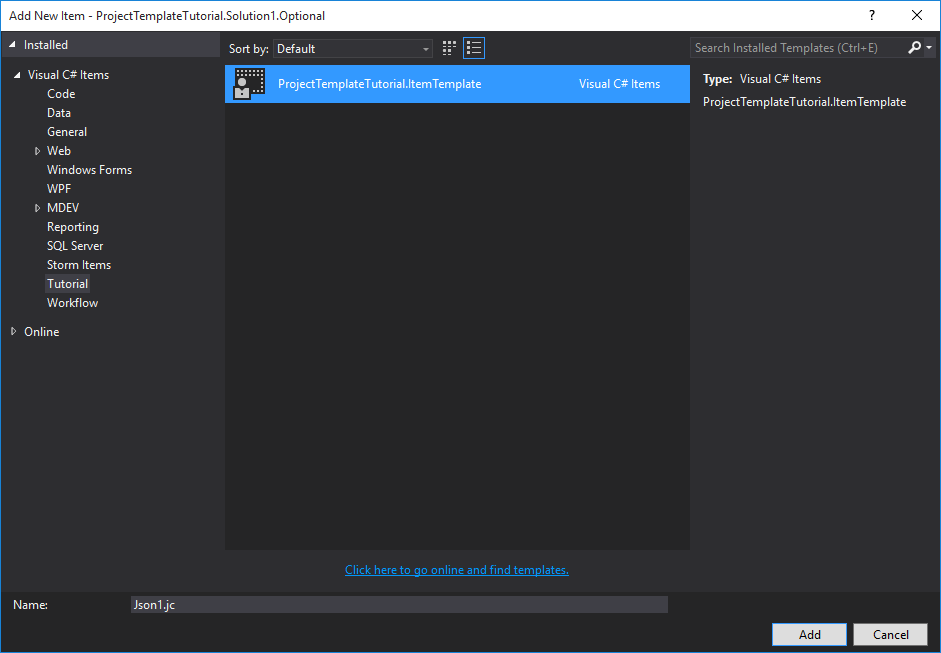

*The item template can be found in the Tutorial category in the New Item dialog*

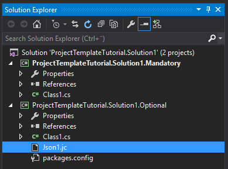

*The Json1.jc file is created in the project*

### T4 (Text Template Transformation Toolkit) Code Generation
Now that we have a item template let's create a custom tool to generate a C# class from it.

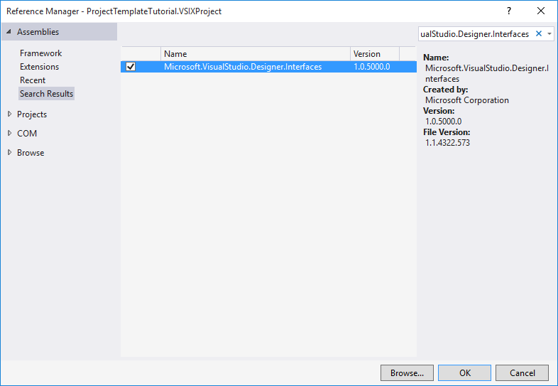

*Add a reference to Microsoft.VisualStudio.Designer.Interfaces in the VSIXProject*


*Add the Newtonsoft.Json NuGet package to the VSIXProject*

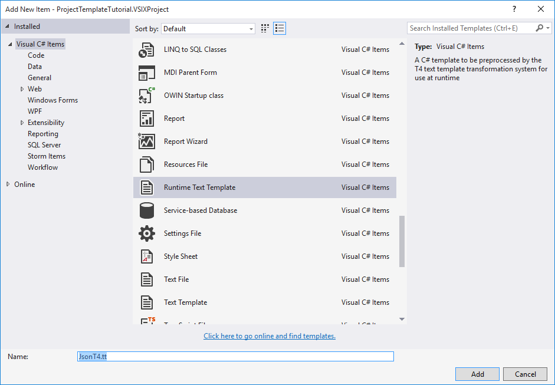

*Add a Runtime Text Tempalte to the Tools folder in the VSIXProject*

```CSharp
<#@ template language="C#" #>
<#@ assembly name="System.Core" #>
<#@ import namespace="System.Linq" #>
<#@ import namespace="System.Text" #>
<#@ import namespace="System.Collections.Generic" #>
<#@ import namespace="System.IO" #>
<#@ import namespace="Newtonsoft.Json" #>
<#@ parameter name="JsonText" type="System.String" #>
<#@ parameter name="JsonNamespace" type="System.String" #>
<#@ parameter name="JsonClass" type="System.String" #>

<#
    Action<string, string> CreateProperty = null; // null to avoid compile-time error
    CreateProperty = delegate(string name, string type)
    {
#>
		public <#= type #> <#= name #> { get; set; }

<#
    };
#>
//------------------------------------------------------------------------------"
// <auto-generated>");
//     This code was generated by a tool.");
//     Runtime Version:4.0.30319.239");
//
//     Changes to this file may cause incorrect behavior and will be lost if");
//     the code is regenerated.");
// </auto-generated>");
//------------------------------------------------------------------------------"

using System;
using Newtonsoft.Json;

namespace <#= JsonNamespace #>
{
	public partial class <#= JsonClass #>
	{
<#
		string propertyName = string.Empty;
		JsonTextReader reader = new JsonTextReader(new StringReader(JsonText));  
		while (reader.Read())
		{
			switch (reader.TokenType)
		    {
		        case JsonToken.PropertyName:
					propertyName = (string)reader.Value;
		            break;
		        case JsonToken.String:
					CreateProperty(propertyName, "string");
		            break;
		        case JsonToken.Boolean:
					CreateProperty(propertyName, "bool");
		            break;
		        case JsonToken.Date:
					CreateProperty(propertyName, "DateTime");
		            break;
		        default:
		            break;
		    }
		}
#>

		public string ToJson()
		{
			return JsonConvert.SerializeObject(this);
		}

		public static <#= JsonClass #> Create(string json)
		{
			return JsonConvert.DeserializeObject<<#= JsonClass #>>(json);
		}
	}
}
```

*Code to generate a C# class from Json*

```CSharp
using Microsoft.VisualStudio;
using Microsoft.VisualStudio.Designer.Interfaces;
using Microsoft.VisualStudio.OLE.Interop;
using Microsoft.VisualStudio.Shell;
using Microsoft.VisualStudio.Shell.Interop;
using System;
using System.CodeDom.Compiler;
using System.Collections.Generic;
using System.IO;
using System.Linq;
using System.Runtime.InteropServices;
using System.Text;
using System.Threading.Tasks;
using IOleServiceProvider = Microsoft.VisualStudio.OLE.Interop.IServiceProvider;

namespace ProjectTemplateTutorial.VSIXProject.Tools
{
    [ComVisible(true)]
    [Guid("1263af09-d434-4a54-8c86-4d4000c394ac")]
    [ProvideObject(typeof(JsonCSharpFileGenerator))]
    [CodeGeneratorRegistration(typeof(JsonCSharpFileGenerator), "JsonCSharpFileGenerator", "{FAE04EC1-301F-11D3-BF4B-00C04F79EFBC}", GeneratesDesignTimeSource = true)]
    public class JsonCSharpFileGenerator : IVsSingleFileGenerator, IObjectWithSite
    {
        private object site = null;
        private CodeDomProvider codeDomProvider = null;
        private ServiceProvider serviceProvider = null;

        private CodeDomProvider CodeProvider
        {
            get
            {
                if (codeDomProvider == null)
                {
                    IVSMDCodeDomProvider provider = (IVSMDCodeDomProvider)SiteServiceProvider.GetService(typeof(IVSMDCodeDomProvider).GUID);
                    if (provider != null)
                        codeDomProvider = (CodeDomProvider)provider.CodeDomProvider;
                }
                return codeDomProvider;
            }
        }

        private ServiceProvider SiteServiceProvider
        {
            get
            {
                if (serviceProvider == null)
                {
                    IOleServiceProvider oleServiceProvider = site as IOleServiceProvider;
                    serviceProvider = new ServiceProvider(oleServiceProvider);
                }
                return serviceProvider;
            }
        }

        public int DefaultExtension(out string pbstrDefaultExtension)
        {
            pbstrDefaultExtension = "." + CodeProvider.FileExtension;
            return VSConstants.S_OK;
        }

        public int Generate(string wszInputFilePath, string bstrInputFileContents, string wszDefaultNamespace, IntPtr[] rgbOutputFileContents, out uint pcbOutput, IVsGeneratorProgress pGenerateProgress)
        {
            if (bstrInputFileContents == null)
                throw new ArgumentException(bstrInputFileContents);

            FileInfo fi = new FileInfo(wszInputFilePath);
            string className = fi.Name.Split('.').First();

            Dictionary<string, object> TemplateParameters = new Dictionary<string, object>();
            TemplateParameters.Add("JsonText", bstrInputFileContents);
            TemplateParameters.Add("JsonNamespace", wszDefaultNamespace);
            TemplateParameters.Add("JsonClass", className);

            JsonT4 t4 = new JsonT4();
            t4.Session = TemplateParameters;
            //t4.WriteLine("//------------------------------------------------------------------------------");
            //t4.WriteLine("// <auto-generated>");
            //t4.WriteLine("//     This code was generated by a tool.");
            //t4.WriteLine("//     Runtime Version:4.0.30319.239");
            //t4.WriteLine("//");
            //t4.WriteLine("//     Changes to this file may cause incorrect behavior and will be lost if");
            //t4.WriteLine("//     the code is regenerated.");
            //t4.WriteLine("// </auto-generated>");
            //t4.WriteLine("//------------------------------------------------------------------------------");
            t4.Initialize();
            string csCode = t4.TransformText();

            //csCode = Format(csCode);
           
            byte[] bytes = Encoding.UTF8.GetBytes(csCode);

            if (bytes == null)
            {
                rgbOutputFileContents[0] = IntPtr.Zero;
                pcbOutput = 0;
            }
            else
            {
                rgbOutputFileContents[0] = Marshal.AllocCoTaskMem(bytes.Length);
                Marshal.Copy(bytes, 0, rgbOutputFileContents[0], bytes.Length);

                pcbOutput = (uint)bytes.Length;
            }

            return VSConstants.S_OK;
        }

        public void GetSite(ref Guid riid, out IntPtr ppvSite)
        {
            if (site == null)
                Marshal.ThrowExceptionForHR(VSConstants.E_NOINTERFACE);

            // Query for the interface using the site object initially passed to the generator
            IntPtr punk = Marshal.GetIUnknownForObject(site);
            int hr = Marshal.QueryInterface(punk, ref riid, out ppvSite);
            Marshal.Release(punk);
            Microsoft.VisualStudio.ErrorHandler.ThrowOnFailure(hr);
        }

        public void SetSite(object pUnkSite)
        {
            // Save away the site object for later use
            site = pUnkSite;

            // These are initialized on demand via our private CodeProvider and SiteServiceProvider properties
            codeDomProvider = null;
            serviceProvider = null;
        }
    }
}
```

*Add the new class JsonCSharpFileGenerator to the tolls folder in tthe VSIXProject*

```xml
<ProjectItem ReplaceParameters="true" TargetFileName="$safeitemname$.jc" CustomTool="JsonCSharpFileGenerator">Json.jc</ProjectItem>
```

*Add the CustomTool attribute to the ProjectItem element in the vstemplate file in the item template project*

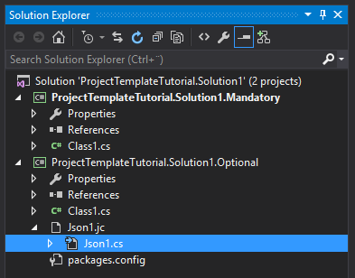

*The item template now creates a generated C# file*

```CSharp
//------------------------------------------------------------------------------"
// <auto-generated>");
//     This code was generated by a tool.");
//     Runtime Version:4.0.30319.239");
//
//     Changes to this file may cause incorrect behavior and will be lost if");
//     the code is regenerated.");
// </auto-generated>");
//------------------------------------------------------------------------------"

using System;
using Newtonsoft.Json;

namespace ProjectTemplateTutorial.Solution1.Optional
{
	public partial class Json1
	{
		public string Email { get; set; }

		public bool Active { get; set; }

		public DateTime CreatedDate { get; set; }


		public string ToJson()
		{
			return JsonConvert.SerializeObject(this);
		}

		public static Json1 Create(string json)
		{
			return JsonConvert.DeserializeObject<Json1>(json);
		}
	}
}
```

*The generated code in the Json1.cs file*

```CSharp
string templatePath = ((Solution4)_dte.Solution).GetProjectItemTemplate("ProjectTemplateTutorial.ItemTemplate", "CSharp");
optionalProject.ProjectItems.AddFromTemplate(templatePath, "Json1.jc");
```

*Add the item template to the optional project in the SolutionWizard class*

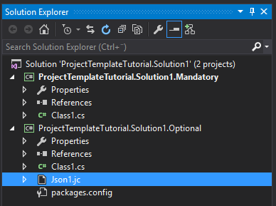

*The item tempalte is now added to the optional project by default when you create a new project*
 
## Step 7 : Refactor some code to a reusable helper library
Let's clean up our code a bit. We have two methods, AddProject and InstallNuGetPackages in the SolutionWizard class, the RelayCommand class and the ProjectExtensions class that we could reuse in other project templates. 
It would also be nice to add the posibility to group project by adding them to solution folders. 
If you skiped the sixth step in this tutorial you can download the code from the [ItemTemplate](https://github.com/dogtail9/ProjectTemplateTutorial/releases) release and start the tutorial here.

### Create a helper library
We will implement our help library as extension methods for the Visual Studio API.


*Start by adding a new class library project*

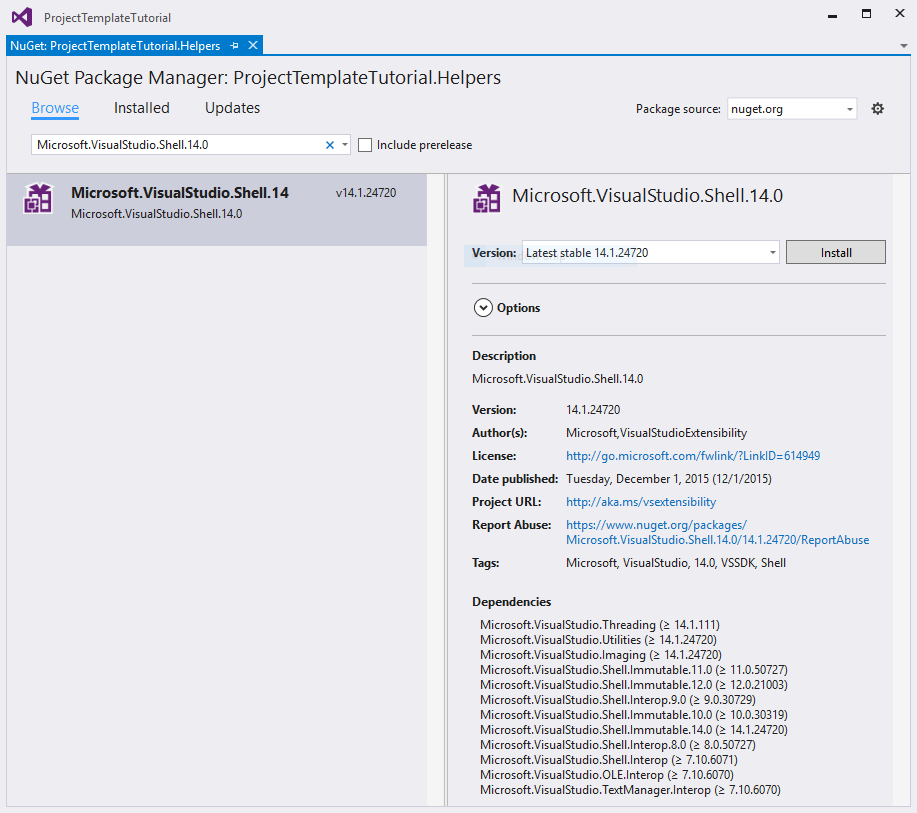

*Add the Microsoft.VisualStudio.Shell.14.0 NuGet package to the Helper project*


*Add the NuGet.VisualStudio NuGet package to the Helper project*


*Add references to the DTE in the Helper project*


*Add a reference to Microsoft.VisualStudio.ComponentModelHost in the Helper project*

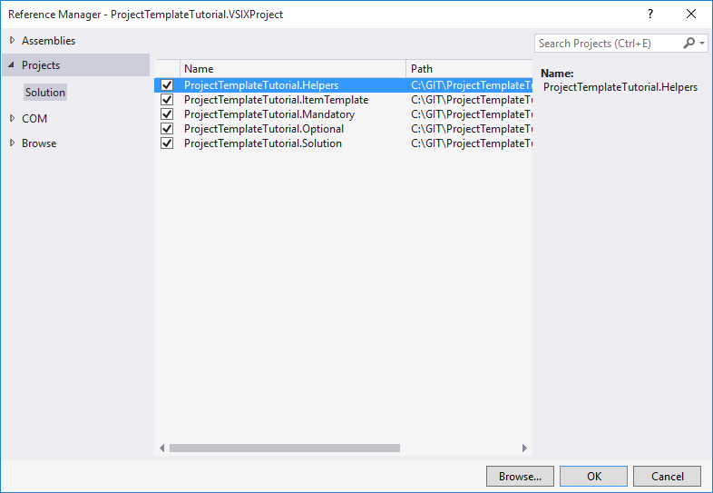

*Add a reference to the helper library in the VSIXProject*

```Csharp
public static class DteExtensions
{
}
```

*Rename the Class1 file to DteExtensions and make it static*

### AddProject
Projects are added to Solutions so let's make the Addproject method an extension method for the Solution class.


```CSharp
public static Project AddProject(this Solution solution, string destination, string projectName, string templateName)
{
    string projectPath = Path.Combine(destination, projectName);
    string templatePath = ((Solution4)solution).GetProjectTemplate(templateName, "CSharp");

    solution.AddFromTemplate(templatePath, projectPath, projectName, false);

    Project project = (from Project p in solution.Projects
                       where p.Name.Equals(projectName)
                       select p).FirstOrDefault();

    return project;
}
```

*Move the AddProject method to the DteExtensions class*

### AddItem
We do not have a method for adding an item to a project so let's add one.

```CSharp
public static void AddItem(this Project project, string itemTemplateName, string itemName)
{
    string templatePath = ((Solution4)project.DTE.Solution).GetProjectItemTemplate(itemTemplateName, "CSharp");
    project.ProjectItems.AddFromTemplate(templatePath, itemName);
}
```

*Add the new method AddItem to the DteExtensions class*

### InstallNuGetPackages
NuGet packages are added to project so let's make the InstallNuGetPackage en axtension method on the Project class.

```CSharp
public static bool InstallNuGetPackage(this Project project, string packageName)
{
    bool installedPkg = true;
    
    try
    {
        var componentModel = (IComponentModel)Package.GetGlobalService(typeof(SComponentModel));
        IVsPackageInstallerServices installerServices = componentModel.GetService<IVsPackageInstallerServices>();
        if (!installerServices.IsPackageInstalled(project, packageName))
        {
            IVsPackageInstaller installer = componentModel.GetService<IVsPackageInstaller>();
            installer.InstallPackage(null, project, packageName, (System.Version)null, false);
        }
    }
    catch (Exception ex)
    {
        installedPkg = false;
    }

    return installedPkg;
}
```

*Move the InstallNuGetPackage to the DteExtensions class*

### Project Responsibility
Resonibilities are properties of a project so let's make it an extension method for the Project class.
We don't want to hard code the responsibilities present in a project template so let's make the SetResponsibility method generic as well.

```CSharp
public static void SetResponsibility<T>(this Project project, params T[] responsibilities)
{
    foreach (var res in Enum.GetValues(typeof(T)))
    {
        string name = res.ToString();
        project.Globals[name] = Boolean.FalseString;
        project.Globals.set_VariablePersists(name, true);
    }

    foreach (var res in responsibilities)
    {
        string name = res.ToString();
        project.Globals[name] = Boolean.TrueString;
        project.Globals.set_VariablePersists(name, true);
    }
}
```

*Move the SetResponsibility method to the DteExtensions class and make it a generic method*

```CSharp
public static bool IsProjectResponsible(this Project project, Enum responsibility)
{
    if (project == null)
        throw new ArgumentNullException(nameof(project));

    if (project.Globals.get_VariableExists(responsibility.ToString()))
    {
        string propertyValue = (string)project.Globals[responsibility.ToString()];
        bool propertyValueBoolean;

        if (Boolean.TryParse(propertyValue, out propertyValueBoolean))
        {
            if (propertyValueBoolean)
            {
                return true;
            }
        }
    }

    return false;
}
```

*Move the IsProjectResponsible method to the DteExtensions class*

### ProjectExtensions
Delete the ProjectExtensions class and rename the file to ProjectResponsibilities.

```CSharp
public enum ProjectResponsibilities
{
    Mandatory,
    Optional
}
```

*Keep only the ProjectResponsibilities enum*

### SolutionWizard
Delete the AddProject and the InstallNuGetPackage methods int the SolutionWizard class.

```CSharp
public void RunFinished()
{
    string destination = _replacementsDictionary["$destinationdirectory$"];
    string fileName = _replacementsDictionary["$safeprojectname$"] + ".sln";
    _dte.Solution.SaveAs(Path.Combine(destination, fileName));

    var projectName = $"{_replacementsDictionary["$safeprojectname$"]}.Mandatory";
    var templateName = "ProjectTemplateTutorial.Mandatory";

    Project mandatoryPproject = _dte.Solution.AddProject(destination, projectName, templateName);
    mandatoryPproject.SetResponsibility(ProjectResponsibilities.Mandatory);

    if (_addOptionalProject)
    {
        projectName = $"{_replacementsDictionary["$safeprojectname$"]}.Optional";
        templateName = "ProjectTemplateTutorial.Optional";

        Project optionalProject = _dte.Solution.AddProject(destination, projectName, templateName);
        optionalProject.SetResponsibility(ProjectResponsibilities.Optional);
        optionalProject.InstallNuGetPackage("Newtonsoft.Json");
        optionalProject.AddItem("ProjectTemplateTutorial.ItemTemplate", "Json1.jc");
    }
}
```

*Use the new extension methods in the RunFinished method in the SolutionWizard class*


### RelayCommandPackage

```Csharp
using ProjectTemplateTutorial.Helpers;
```

*Add the using for the helper library to the RelayCommandPackage class*

### Solution folders
Let's add the functionality to handle solution folder in our project template.

### GetSolutionFolderEx
We want to add solutionfolders but first we need to check if they already exists. 

```CSharp
public static SolutionFolder GetSolutionFolderEx(this Solution solution, string folderName)
{
    Project solutionFolder = (from p in ((Solution2)solution).Projects.OfType<Project>()
                              where p.Name.Equals(folderName)
                              select p).FirstOrDefault();

    return solutionFolder?.Object;
}

public static SolutionFolder GetSolutionFolderEx(this SolutionFolder solutionFolder, string folderName)
{
    ProjectItem folder = (from p in solutionFolder.Parent.ProjectItems.OfType<ProjectItem>()
                          where p.Name.Equals(folderName)
                          select p).FirstOrDefault();

    return ((Project)folder?.Object)?.Object;
}
```

*The GetSolutionFolderEx methods return the SolutionFolder object if it exists otherwise they return null*

### AddSolutionFolderEx
Now we are ready to add solution folders to the project template. We need a way to add a solution folder to the root of the solution and a way to add a solution folder to another solutionfolder.

```CSharp
public static SolutionFolder AddSolutionFolderEx(this Solution solution, string folderName)
{
    SolutionFolder folder = solution.GetSolutionFolderEx(folderName);

    if (folder == null)
    {
        folder = ((Solution4)solution).AddSolutionFolder(folderName).Object;
    }

    return folder;
}

public static SolutionFolder AddSolutionFolderEx(this SolutionFolder solutionFolder, string folderName)
{
    SolutionFolder folder = solutionFolder.GetSolutionFolderEx(folderName);

    if (folder == null)
    {
        folder = solutionFolder.AddSolutionFolder(folderName).Object;
    }

    return folder;
}
```

*The AddSolutionFolderEx methods adds a folder to either the solution or another SolutionFolder and returns the newly created SolutionFolder. If the SolutionFolder already exists it will return that SolutionFolder.*

### GetProject
Create a new method that we can reuse when we add a project to our solution or to a solution folder.

```CSharp
private static Project GetProject(string projectName)
{
    DTE _dte = ServiceProvider.GlobalProvider.GetService(typeof(DTE)) as DTE;
    Project project = (from Project p in (Array)_dte.ActiveSolutionProjects
                       where p.Name.Equals(projectName)
                       select p).FirstOrDefault();

    return project;
}
```
*Get a project by name*

### AddProject

```CSharp
public static Project AddProject(this Solution solution, string destination, string projectName, string templateName)
{
    string projectPath = Path.Combine(destination, projectName);
    string templatePath = ((Solution4)solution).GetProjectTemplate(templateName, "CSharp");

    solution.AddFromTemplate(templatePath, projectPath, projectName, false);

    return GetProject(projectName);
}

public static Project AddProject(this SolutionFolder solutionFolder, string destination, string projectName, string templateName)
{
    string projectPath = Path.Combine(destination, projectName);
    string templatePath = ((Solution4)solutionFolder.DTE.Solution).GetProjectTemplate(templateName, "CSharp");

    solutionFolder.AddFromTemplate(templatePath, projectPath, projectName);

    return GetProject(projectName);
}
```

*Use the GetProject method in the already existing AddProject method. Add a method to add a project to a solution folder*
### Update the SolutionWizard


*Export a new image for the folders and add the file to the Resources folder in the VSIXProject*

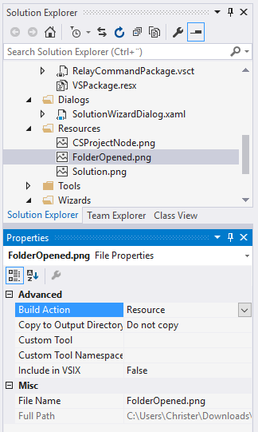

*Change the the Build Action of the FolderOpened.png file to Recource*

```xml
<platformUI:DialogWindow x:Class="ProjectTemplateTutorial.VSIXProject.Dialogs.SolutionWizardDialog"
             xmlns="http://schemas.microsoft.com/winfx/2006/xaml/presentation"
             xmlns:x="http://schemas.microsoft.com/winfx/2006/xaml"
             xmlns:mc="http://schemas.openxmlformats.org/markup-compatibility/2006" 
             xmlns:local="clr-namespace:ProjectTemplateTutorial.VSIXProject.Dialogs"
             xmlns:platformUI="clr-namespace:Microsoft.VisualStudio.PlatformUI;assembly=Microsoft.VisualStudio.Shell.14.0"
             Width="370" 
             Height="210"
             Title="Create Solution"
             WindowStartupLocation="CenterScreen" 
             ResizeMode="NoResize" 
             ShowInTaskbar="False">
    <Grid>
        <Image Source="pack://application:,,,/ProjectTemplateTutorial.VSIXProject;component/Resources/Solution.png" 
               Width="15" 
               Height="15" 
               VerticalAlignment="Top" 
               HorizontalAlignment="Left"
               Margin="10,10,0,0"/>

        <Image Source="pack://application:,,,/ProjectTemplateTutorial.VSIXProject;component/Resources/FolderOpened.png" 
               Width="15" 
               Height="15" 
               VerticalAlignment="Top" 
               HorizontalAlignment="Left" 
               Margin="30,31,0,0"/>

        <Image Source="pack://application:,,,/ProjectTemplateTutorial.VSIXProject;component/Resources/FolderOpened.png"
               Width="15" 
               Height="15" 
               VerticalAlignment="Top" 
               HorizontalAlignment="Left" 
               Margin="50,52,0,0"/>

        <Image Source="pack://application:,,,/ProjectTemplateTutorial.VSIXProject;component/Resources/CSProjectNode.png" 
               Width="15" 
               Height="15"
               VerticalAlignment="Top"
               HorizontalAlignment="Left"
               Margin="70,73,0,0"/>

        <Image Source="pack://application:,,,/ProjectTemplateTutorial.VSIXProject;component/Resources/FolderOpened.png"
               Width="15"
               Height="15"
               VerticalAlignment="Top"
               HorizontalAlignment="Left"
               Margin="50,94,0,0"/>

        <Image Source="pack://application:,,,/ProjectTemplateTutorial.VSIXProject;component/Resources/CSProjectNode.png" 
               Width="15"
               Height="15"
               VerticalAlignment="Top"
               HorizontalAlignment="Left"
               Margin="70,114,0,0"/>

        <TextBlock x:Name="SolutionNameTbx" 
                   HorizontalAlignment="Stretch" 
                   VerticalAlignment="Top"
                   Margin="30,10,10,0" 
                   Text="SolutionName"/>

        <CheckBox x:Name="SourceFolderCbx" 
                  HorizontalAlignment="Stretch" 
                  VerticalAlignment="Top" 
                  Content="Source"
                  Margin="50,31,10,0" />

        <CheckBox x:Name="MandatoryProjectSolutionFolderCbx" 
                   HorizontalAlignment="Stretch" 
                   VerticalAlignment="Top" 
                   Margin="70,52,10,0" 
                   IsChecked="True"
                   Content="Mandatory"/>

        <TextBlock x:Name="MandatoryProjectNameTbx" 
                   HorizontalAlignment="Stretch" 
                   VerticalAlignment="Top" 
                   Margin="90,73,10,0" 
                   Text="MandatoryProjectName"/>

        <CheckBox x:Name="OptionalProjectSolutionFolderCbx" 
                   HorizontalAlignment="Stretch" 
                   VerticalAlignment="Top" 
                   Margin="70,94,10,0"
                   IsChecked="True"
                   Content="Optional"/>

        <CheckBox x:Name="OptionalProjectNameCbx" 
                  HorizontalAlignment="Stretch" 
                  VerticalAlignment="Top" 
                  Margin="90,114,10,0" 
                  IsChecked="True"
                  Content="OptionalProjectName" />

        <Button x:Name="CancelBtn" 
                HorizontalAlignment="Right" 
                VerticalAlignment="Bottom" 
                Width="75" 
                Content="Cancel" 
                Margin="0,0,10,10" 
                Click="CancelBtn_Click"/>

        <Button x:Name="OKBtn" 
                HorizontalAlignment="Right" 
                VerticalAlignment="Bottom" 
                Width="75" 
                Content="OK" 
                Margin="0,0,90,10" 
                Click="OKBtn_Click"/>
    </Grid>
</platformUI:DialogWindow>
```

*Add icons and checkboxes for the solution folder in the SolutionWizardDialog.xaml file*

```CSharp
private bool _sourceFolder;
private bool _mandatoryFolder;
private bool _optionalFolder;
```

*Add new fileds to the SolutionWizard class to store values from the SolutionWizardDialog*

```CSharp
_sourceFolder = (bool)dialog.SourceFolderCbx.IsChecked;
_mandatoryFolder = (bool)dialog.MandatoryProjectSolutionFolderCbx.IsChecked;
_optionalFolder = (bool)dialog.OptionalProjectSolutionFolderCbx.IsChecked;
```

*Store the values from the SolutionWizardDialog in the new fileds in the RunStarted method in the SolutionWizard class*

```CSharp
private Project AddProject(string projectSufix, string templateName, SolutionFolder sourceSolutionFolder = null, string folderName = null)
{
    string destination = _replacementsDictionary["$destinationdirectory$"];

    if (_sourceFolder)
    {
        destination = Path.Combine(destination, "Source");
    }

    var projectName = $"{_replacementsDictionary["$safeprojectname$"]}.{projectSufix}";

    Project project;
    if (sourceSolutionFolder == null)
    {
        if (folderName != null)
        {
            SolutionFolder optionalFolder = _dte.Solution.AddSolutionFolderEx(folderName);
            project = optionalFolder.AddProject(destination, projectName, templateName);
        }
        else
        {
            project = _dte.Solution.AddProject(destination, projectName, templateName);
        }
    }
    else
    {
        if (folderName != null)
        {
            SolutionFolder folder = (SolutionFolder)sourceSolutionFolder.AddSolutionFolderEx(folderName);
            project = folder.AddProject(destination, projectName, templateName);
        }
        else
        {
            project = sourceSolutionFolder.AddProject(destination, projectName, templateName);
        }
    }

    return project;
}
```

*Add a new private method called AddProject that handles the project creation logic in the SolutionWizard class*

```CSharp
public void RunFinished()
{
    string destination = _replacementsDictionary["$destinationdirectory$"];
    string fileName = _replacementsDictionary["$safeprojectname$"] + ".sln";
    _dte.Solution.SaveAs(Path.Combine(destination, fileName));

    SolutionFolder sourceSolutionFolder = null;
    if (_sourceFolder)
        sourceSolutionFolder = _dte.Solution.AddSolutionFolderEx("Source");

    string mandatoryFolderName = null;
    if (_mandatoryFolder)
        mandatoryFolderName = "Mandatory";

    string optionalFolderName = null;
    if (_optionalFolder)
        optionalFolderName = "Optional";


    Project mandatoryPproject = AddProject("Mandatory", "ProjectTemplateTutorial.Mandatory", sourceSolutionFolder, mandatoryFolderName);
    mandatoryPproject.SetResponsibility(ProjectResponsibilities.Mandatory);

    Project mandatoryPproject2 = AddProject("Mandatory2", "ProjectTemplateTutorial.Mandatory", sourceSolutionFolder, mandatoryFolderName);
    mandatoryPproject2.SetResponsibility(ProjectResponsibilities.Mandatory);

    if (_addOptionalProject)
    {
        Project optionalProject = AddProject("Optional", "ProjectTemplateTutorial.Optional", sourceSolutionFolder, optionalFolderName);
        optionalProject.SetResponsibility(ProjectResponsibilities.Optional);
        optionalProject.InstallNuGetPackage("Newtonsoft.Json");
        optionalProject.AddItem("ProjectTemplateTutorial.ItemTemplate", "Json1.jc");
    }
}
```

*Change the RunFinished method in the SolutionWizard class sp that it uses the new AddProject method*
 
### AddReference


*Add a reference to VSLangProj in the Helpers project*

````CSharp
public static void AddReference(this Project project, Project projectToAdd)
{
    (project.Object as VSProject).References.AddProject(projectToAdd);
}
```
*Add the AddReference method to the DteExtensions class*

```CSharp
mandatoryPproject.AddReference(optionalProject);
```

*Add the optional project as a reference to the mandatory project in the SolutionWizzard class*
 
### SetAsStartup

```CSharp
public static void SetAsStartup(this Project project)
{
    DTE _dte = ServiceProvider.GlobalProvider.GetService(typeof(DTE)) as DTE;
    _dte.Solution.Properties.Item("StartupProject").Value = project.Name;
}
```

*Add the SetAsStartup method to the DteExtensions class*
 
```CSharp
optionalProject.SetAsStartup();
```

*Set the optional project as the startup project in the SolutionWizard class*

### ShowStatusBarMessage
If an operation is taking longer then a second it is nice to give the user some feedback about what is happening. 
In visual Studio you can do that in the statusbar.

```CSharp
public static void ShowStatusBarMessage(this string message)
{
    DTE _dte = ServiceProvider.GlobalProvider.GetService(typeof(DTE)) as DTE;
    _dte.StatusBar.Text = message;
}
```

*Add the ShowStatusBarMessage method to the DteExtensions class*

```CSharp
$"Installing {packageName} NuGet package, this may take a minute...".ShowStatusBarMessage();
```

*Show a message in the statusbar about a nuget package beeing installed*


*Visual Studio telling the user that the Newtonsoft.Json NuGet package is added*

### Move the RelayCommand class to the Helper project


*Add a reference to System.Design in the Helpers project*


*Add a references to Microsoft.Shell.Interop.{10.0, 11.0, 12.0} in the Helpers project*

```Csharp
public class RelayCommand
{
    private readonly Package package;

    public RelayCommand(Package package, int commandId, Guid commandSet, Action<object, EventArgs> menuCallback, Action<object, EventArgs> beforeQueryStatus = null)
    {
        this.package = package;

        OleMenuCommandService commandService = ServiceProvider.GetService(typeof(IMenuCommandService)) as OleMenuCommandService;
        if (commandService != null)
        {
            var MenuCommandID = new CommandID(commandSet, commandId);
            var MenuItem = new OleMenuCommand(menuCallback.Invoke, MenuCommandID);
            if (beforeQueryStatus != null)
            {
                MenuItem.BeforeQueryStatus += beforeQueryStatus.Invoke;
            }
            commandService.AddCommand(MenuItem);
        }
    }

    private IServiceProvider ServiceProvider => this.package;
}
```

*Move the RelayCommand class to the Helper project*
