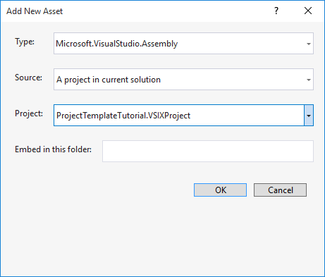
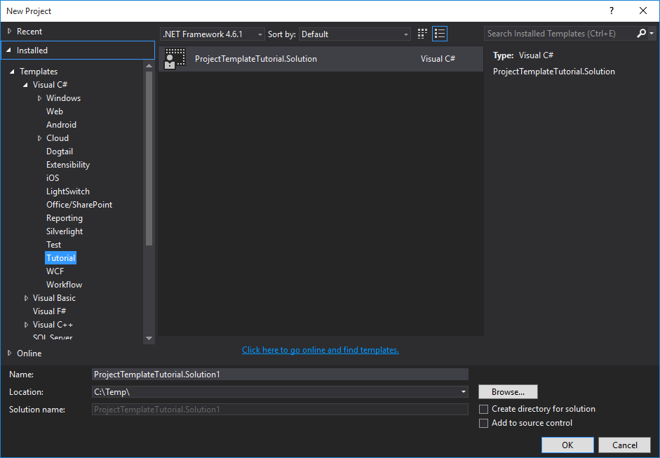

# ProjectTemplateTutorial
This is a tutorial on how to create a project template for Visual Studio with multiple projects, commands, dialogs and external tools.
The project template will have a mandatory and an optional project that you can choose from an dialog when the project is created.
There will also be an item template that uses Text Template Transformation Toolkit (T4) to generate code from an DSL.

## Prerequisites
I have the following softwares installed on my machine.

* Visual Studio 2015 Update 1
* Visual Studio SDK
* [Extensibility Tools for Visual Studio](https://github.com/madskristensen/ExtensibilityTools)
* [ILSyp](http://ilspy.net/)

## Create a custom project template
This is a tutorial on how to create a project template with multiple projects, custom commands and dialogs. We will also add an external tool that generate code from a domain specific language.

### Solution
First we need a solution to add our project to. Open Visual Studio and follow the steps bellow.


*Choose the blank solution project template*

Now we have our solution that we can start adding project to.

### VSIX Project
The VSIX project where we will put all logic such as wizards, commands and dialogs. 


*Add a VSIX Project to the solution*


*Delete the unnecessary files*


*Add folders for Commands, Dialogs and Wizards*

## Solution Project Template
Now we will add to a project template whose sole purpose is to run a wizard, where we can add the code to create our project.


*Add the solution project template*


*Delete the unnecessary files*

```xml
<Project File="ProjectTemplate.csproj" ReplaceParameters="true">
  <ProjectItem ReplaceParameters="true" TargetFileName="Properties\AssemblyInfo.cs">AssemblyInfo.cs</ProjectItem>
  <ProjectItem ReplaceParameters="true" OpenInEditor="true">Class1.cs</ProjectItem>
</Project>
```

*Delete the content of the TemplateContent element in the ProjectTemplateTutorial.Solution.vstemplate file*


*Change the type attribute of the VSTemplate element in the vstemplate file to ProjectGroup*


*Add a category for the project template in the new project dialog*


## Solution wizard
Now we need to add a wizard class where the logic for creating our project template.
Add a class to the Wizard folder in the VSIXProject, name it SolutionWizard. The SolutionWizard class should implement the IWizard interface.
Sign all projects in the solution.


*Add the references to envdte and Microsoft.VisualStudio.TemplateWizardInterface in the VSIXProject*

```CSharp
using Microsoft.VisualStudio.TemplateWizard;
using System;
using System.Collections.Generic;
using System.Linq;
using System.Text;
using System.Threading.Tasks;
using EnvDTE;

namespace ProjectTemplateTutorial.VSIXProject.Wizards
{
    public class SolutionWizard : IWizard
    {
        public void BeforeOpeningFile(ProjectItem projectItem)
        {
        }

        public void ProjectFinishedGenerating(Project project)
        {
        }

        public void ProjectItemFinishedGenerating(ProjectItem projectItem)
        {
        }

        public void RunFinished()
        {
            int i = 0;
        }

        public void RunStarted(object automationObject, Dictionary<string, string> replacementsDictionary, WizardRunKind runKind, object[] customParams)
        {
        }

        public bool ShouldAddProjectItem(string filePath) => true;
    }
}
```

*The SolutionWizard class*

Set a breakpoint in the int i = 0; line in the RunFinished method.

## Assets
The only thing left to do is to add assets to the VSIXProject. Open the source.extension.vsixmanifest file in the VSIXProject. Add the assets below.



*Add assembly*


*Add project template*

## Add the wizard to the solution project template


*I use ILSpy to get the strongname of the ProjectTemplate.VSIXProject.dll*

```xml
<WizardExtension>
  <Assembly>ProjectTemplateTutorial.VSIXProject, Version=1.0.0.0, Culture=neutral, PublicKeyToken=b490d4518b7bc751</Assembly>
  <FullClassName> ProjectTemplateTutorial.VSIXProject.Wizards.SolutionWizard</FullClassName>
</WizardExtension>
```

*Add the WizardExtension element to VSTemplate element in the vstemplate file*

Let´s try to create a project with our project template.



*The project template is located in the tutorial category in the New Project dialog*


*The break point in the RunFinished method should be hit*


*The empty solution created is created*

We are done with the first step out of this tutorial.

## Mandatory project template
Let´s add the project template for the mandatory project in our project template.
If you skiped the first step in this tutorial you can download the code from the [Solution](https://github.com/dogtail9/ProjectTemplateTutorial/releases) release and start the tutorial here.  

*Add the mandatory project template*

*Code to add the mandatory project to the solution*

*Project created*

## Optional project template
Let´s add the project template for the optional project in our project template.

*Add the optional project template*

## Project creation dialog
We need a dialog to select the projects to be created.

*Add a CustomControl*

*Change the root element to Window*

*Change the base class in the code behind file to Window*

```xml
<Window>
</Window>
```
*The XAML for the solution dialog*

```CSharp
public void AddProject()
{
}
```
*Code to add the optional project to the solution*


*Project created*

## Add NuGet packages as part of the project creation process

### NuGet helper code

### Add NuGet packages

## Add a command

### VSPackage

### RelayCommand

### Implement some usefull feature with a dialog and NuGet packages

## Create a custom item template

### Item template

### T4 (Text Template Transformation Toolkit) Code Generation 
